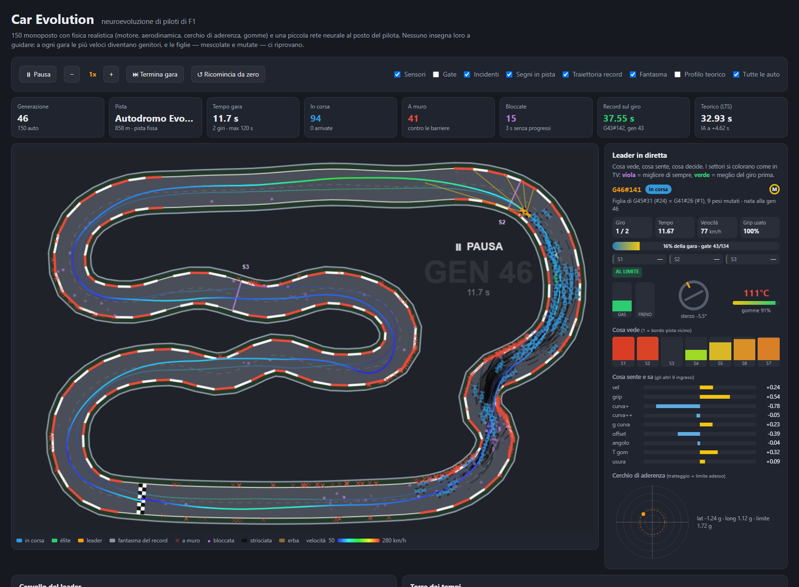

# 🏎️ Car Evolution

**Neuroevoluzione di piloti di Formula 1, nel browser.**
150 monoposto con una fisica realistica e una piccola rete neurale al posto del pilota.
Nessuno insegna loro a guidare: a ogni gara le più veloci diventano genitori, e le figlie
— mescolate e mutate — ci riprovano. Dopo qualche decina di generazioni imparano da sole
a frenare prima delle curve, a scegliere la traiettoria e a gestire le gomme.

### 🎮 [Provala subito nel browser →](https://matteobaisini.github.io/car-evolution/car-project.html)



> Progetto didattico: ogni file è commentato per spiegare *perché* le cose funzionano,
> dalla geometria della pista alla dinamica del veicolo all'algoritmo genetico.
> Zero dipendenze: HTML, CSS e JavaScript puro su `<canvas>`.

---

## ▶️ Come avviarlo

Non serve installare niente. Puoi usare la [demo online](https://matteobaisini.github.io/car-evolution/car-project.html),
oppure scaricare il repository e aprire `car-project.html` nel browser:

```bash
git clone https://github.com/MatteoBaisini/car-evolution.git
cd car-evolution
start car-project.html        # Windows  (macOS: open, Linux: xdg-open)
```

**Tasti:** `Spazio` pausa · `+`/`−` velocità di simulazione (fino a 64×) · `N` termina la gara ·
`S` sensori · `G` gate · `↑ ↓ ← →` guida (modalità "Guida tu").

Consiglio: porta la velocità a 32–64× e guarda il grafico della fitness salire.
Di solito le prime auto completano la gara tra la generazione 25 e la 40.

---

## 🧠 Come imparano

```
            ┌──────────── una generazione = una gara ────────────┐
 sensori ──► rete neurale ──► gas/freno, sterzo ──► fisica ──► fitness
            └─────────────────────────────────────────────────────┘
                                   │
         selezione a torneo ◄──────┘
                 │
         crossover + mutazione ──► 150 figlie ──► nuova gara
```

| Fase | Cosa succede | Dove |
|---|---|---|
| **Percepire** | 16 ingressi: 7 raggi verso il bordo pista, velocità, grip usato, curve in arrivo, "g richiesti dalla prossima curva", posizione e angolo sulla pista, temperatura e usura gomme | `js/sensors.js` |
| **Decidere** | Rete feed-forward 16 → 12 → 2, attivazione `tanh`, inizializzazione di Xavier. Uscite analogiche: gas/freno e sterzo in [−1, 1] | `js/network.js` |
| **Votare** | `fitness = giri percorsi` se non arriva; `L + L·(1 − t/tMax)` se finisce la gara di L giri. Qualsiasi arrivata batte qualsiasi non-arrivata; tra le arrivate vince la più veloce | `js/car.js` |
| **Riprodursi** | Élite copiate identiche; le altre da due genitori scelti a torneo, crossover uniforme dei 230 pesi, mutazione gaussiana | `js/genetic.js` |
| **Esame** | La campionessa corre da sola su piste **mai viste** per misurare l'overfitting | `js/genetic.js` |

Non c'è backpropagation né alcun esempio di guida corretta: i pesi emergono solo dalla selezione.

---

## 🔧 La fisica (unità SI)

Il modello (`js/physics.js`, `js/car.js`) è semplificato ma fisicamente coerente:

- **Motore a potenza costante** — `a = P / (m·v)`, limitato dal grip (controllo di trazione).
- **Aerodinamica** — resistenza `k_D·v²` e carico verticale `k_L·v²`: la velocità di punta
  nasce dall'equilibrio tra potenza e resistenze.
- **Cerchio di aderenza** — `a_lat² + a_long² ≤ [μ·(g + k_L·v²)]²`. Il grip usato per frenare
  non è disponibile per curvare: bisogna frenare *prima* della curva.
- **Modello a bicicletta** — `ω = v·tan(δ)/L`. Se la curva chiede più grip di quello disponibile
  l'auto **sottosterza**, e le gomme strisciano, si scaldano e si consumano.
- **Gomme** — finestra di temperatura ottimale (~95 °C) e usura, in tre mescole (soft/medium/hard).
- **Erba** tra asfalto e muro: poco grip e molta resistenza. Si può sbagliare e recuperare.
- **Scia e contatti** tra auto (opzionali).

Con il setup di base: 345 km/h di punta, 2,0 g di grip a 100 km/h e 4,2 g a 250 km/h,
frenata 200 → 80 km/h in 49 m.

### Lap Time Simulation
Il "tempo teorico" mostrato ovunque è una **simulazione quasi-statica del giro**, la base di quelle usate
dai team: velocità limite in curva, poi una passata in avanti (accelerazione) e una all'indietro (frenata).
Segue la linea centrale, quindi un buon pilota — umano o IA — può anche batterla allargando le curve.

---

## 📊 Cosa mostra la pagina

| Scheda | Contenuto |
|---|---|
| **Pista** | Traiettoria del record colorata per velocità, fantasma del record, segni di frenata, punti degli incidenti, settori |
| **Leader in diretta** | Cosa vede e cosa decide la rete, pedali, volante, gomme, cerchio di aderenza live, settori colorati come in TV |
| **Apprendimento** | Fitness, esiti per generazione, diversità genetica, distribuzione della fitness, classifica con genealogia, diario |
| **Telemetria** | Velocità / gas-freno / sterzo / temperatura gomme lungo il giro, diagramma g-g, tabella settori con "giro ideale" |
| **Ingegneria vettura** | Setup (potenza, ala, massa, mescola), scheda tecnica, velocità in curva vs raggio, ottimizzazione dell'ala via LTS |
| **Generalizzazione** | Allenamento vs esame su piste mai viste, modalità di allenamento (fissa / rotazione / casuale), salva e carica il cervello in JSON |
| **Guida tu & Demo** | Guida con la tastiera e sfida l'IA e il tempo teorico, con la stessa fisica |

---

## 🗂️ Struttura

```
car-project.html   pagina e layout
style.css          stile
js/
  util.js          unità di misura, generatore casuale con seed
  physics.js       modello del veicolo + Lap Time Simulation
  track.js         geometria della pista, spline Catmull-Rom, griglia spaziale, validazione
  tracks.js        catalogo dei circuiti + generatore procedurale
  car.js           dinamica della monoposto, gomme, cronometro, telemetria
  sensors.js       i 16 ingressi della rete
  network.js       rete neurale e genoma
  genetic.js       algoritmo genetico, gara, esame di generalizzazione
  charts.js        grafici su canvas (senza librerie)
  dashboard.js     pannelli di dati
  main.js          loop, disegno, comandi, demo
```

---
